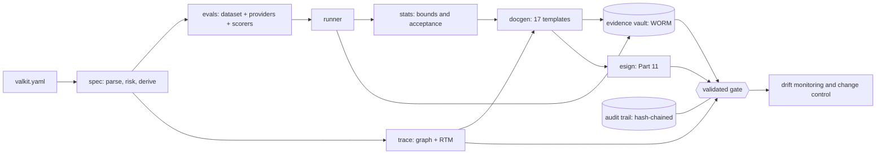

# ValKit

**Part 11 validation-as-code for LLM agents in GxP workflows.**

Declare an agent's context of use, risk, qualification data and acceptance
criteria in a `valkit.yaml`. ValKit runs the evaluation battery, computes
acceptance as one-sided confidence bounds, and generates the signed
computer-system-validation package: requirements, GAMP 5 risk assessment, an
FDA-style credibility assessment, IQ/OQ/PQ protocols and reports, a
requirements-to-test traceability matrix and a validation summary — backed by a
hash-chained audit trail, immutable evidence and 21 CFR Part 11 electronic
signatures.

> **Naming.** "ValKit" is a working name used during development. An unrelated
> operating company uses the domain valkit.ai. The name has to change before
> any public release.

## The gap this fills

Evaluation tools — LangSmith, Langfuse, promptfoo, DeepEval — produce metrics
and traces, and no regulatory documents. Validation platforms — ValGenesis,
Kneat, Veeva Vault Validation — manage documents and workflows, and cannot
evaluate a non-deterministic agent. Between an eval run and a signed validation
package sits a manual gap that today is filled by consultants.

ValKit closes that gap in one direction: it starts from the evaluation run of a
non-deterministic agent and ends at a statistically defensible, signed package,
then keeps the agent validated with scheduled re-evaluation and change control.

## Quick start

Runs entirely offline against a deterministic fixture provider — no
credentials, no network.

```bash
git clone <this repository> && cd Valkit
python -m venv .venv && .venv/bin/pip install -e '.[dev]'

.venv/bin/python examples/demo.py
```

That takes a specification, assesses risk, derives requirements and tests, runs
the battery over 65 curated clinical cases, calibrates the judge, generates
fifteen documents, applies Part 11 signatures from two distinct signers, seals
the evidence, and prints:

```
Status: VALIDATED
  audit trail      out/demo/audit-trail.txt (57 events, chain intact)
  evidence vault   out/demo/.valkit/vault (19 objects, 19 verified)
```

Read `out/demo/OQ_REPORT.md` first — it is where the statistics surface — then
`out/demo/CREDIBILITY_REPORT.md`, which is structured as the FDA framework's
seven steps.

### From the command line

```bash
valkit validate examples/valkit.yaml    # check the spec, show the risk assessment
valkit sample-size --target 0.98        # size a golden set before committing to a target
valkit run examples/valkit.yaml         # execute the battery, print bounds
valkit package examples/valkit.yaml -o out --html
valkit rtm examples/valkit.yaml         # the traceability matrix
valkit verify                           # audit chain + evidence vault
```

Exit codes are a contract with CI: `0` success, `1` acceptance not met, `2`
usage error, `3` integrity failure. Integrity is separate from acceptance
because "the evidence cannot be trusted" is a different conversation from "the
agent did not meet its target".

## The specification

```yaml
apiVersion: valkit/v1
kind: AgentValidation

metadata:
  agent_id: rave-als-generator
  version: 2.3.1

context_of_use:            # steps 1 and 2 of the FDA credibility framework
  question_of_interest: >
    Does the agent correctly generate ALS entries from a study protocol?
  role: >
    Assistive. Every entry is reviewed by an EDC build engineer before load.
  model_influence: medium      # the two axes of the model risk matrix
  decision_consequence: medium
  human_in_the_loop: true

intended_use:
  in_scope:  [ALS field generation, edit-check suggestion]
  out_of_scope: [loading to production without review]   # becomes a testable requirement

gamp:
  category: 5

models:
  primary: bedrock/anthropic.claude-sonnet-4
  judge: bedrock/anthropic.claude-opus-4
  phi_safe_local: ollama/llama3.1:70b     # PHI-flagged cases are routed here
  temperature: 0.0
  seed: 0

datasets:
  golden_set:
    ref: datasets/golden.jsonl
    sha256: 4efff9dc…            # pin it, or the run cannot be proven repeatable

acceptance:
  metrics:
    - name: field_accuracy
      scorer: exact_match
      target: 0.95
      confidence: 0.95
      method: clopper_pearson_lower
      strata: [form]
  judge_calibration:
    min_cohen_kappa: 0.80

monitoring:
  schedule: "0 6 * * 1"

signoff:
  approvers: [qa_lead]
  esignature: part11
```

`examples/valkit.yaml` is the fully commented version; it doubles as the
reference.

## The statistical method, briefly

An agent that passes 176 of 180 cases has an observed rate of 0.978. That is
not the claim ValKit puts in a signed report. The claim is the **one-sided
lower confidence bound** — the value the true rate exceeds with the stated
confidence — because the observed rate describes the sample and the bound is
what the sample supports.

Sizing follows from that, and it is the thing most worth knowing before you
build a golden set. With zero failures allowed, at 95% confidence:

| Target pass rate | Minimum cases |
| --- | --- |
| 0.95 | 59 |
| 0.98 | 149 |
| 0.99 | 299 |

Tolerating failures raises it sharply: demonstrating 0.95 with one failure
needs 93 cases, with two needs 124. Run `valkit sample-size --target 0.98
--failures 2` before committing to a target, not after the run.

Clopper-Pearson is the default because it is exact and conservative, and
conservative is the right direction to err when overstating performance has a
patient-safety or data-integrity consequence. Wilson is available and tighter,
and the choice is recorded in the specification and stated in the report.

The arithmetic assumes the cases are independent and representative of the
intended use. Nothing in the arithmetic can establish that. It rests on
curating the golden set, which is why `valkit run` reports the set's
composition — strata, labelled cases, duplicate inputs — and the credibility
report prints it.

Full treatment in [docs/statistics.md](docs/statistics.md).

## What is in the box

| Module | What it does |
| --- | --- |
| `valkit.spec` | Loads and validates `valkit.yaml`; assesses model risk; derives requirements, risks and IQ/OQ/PQ tests |
| `valkit.stats` | Confidence bounds, sample sizing, Cohen's kappa, the acceptance decision. Pure Python, no SciPy |
| `valkit.evals` | Datasets with pinned digests, model providers, scorers, the LLM judge, the run harness |
| `valkit.docgen` | 17 document templates, strict rendering, HTML output |
| `valkit.trace` | The traceability graph and the RTM — and, mainly, finding the gaps |
| `valkit.audit` | Hash-chained append-only audit trail (21 CFR 11.10(e)) |
| `valkit.vault` | Content-addressed immutable evidence, locally or on S3 Object Lock |
| `valkit.esign` | 21 CFR Part 11 subpart C electronic signatures |
| `valkit.pipeline` | The lifecycle, and the gate that decides validated status |

Some choices worth knowing about:

**The core depends on PyYAML and Jinja2, and nothing else.** In a GxP tool every
third-party package is a supplier that has to be assessed, so the statistics are
implemented from published algorithms in pure Python and verified against
independently derived values. Optional extras (FastAPI, boto3, python-docx) are
imported lazily; the core workflow never needs them.

**Runs are reproducible.** Same specification, dataset, seed and provider gives a
byte-identical run record and byte-identical documents. That is what lets a
regenerated document be compared against the signed one.

**Evidence is content-addressed, so the identifier is the digest.** An
identifier that resolves is itself proof of integrity; reads re-derive the
digest rather than trusting an index; overwriting is impossible by construction
rather than merely forbidden.

**PHI never reaches a hosted provider by accident.** If the specification names
a local model for PHI and the dataset contains PHI-flagged cases, evaluation
refuses to start unless a local provider was actually supplied.

## Architecture



More, with the deployment and data-model views, in
[docs/architecture.md](docs/architecture.md).

## Compliance posture

ValKit is built against **final** standards and applies **draft** frameworks as
scaffolding. The distinction is maintained everywhere, including in the
generated documents:

| | Status |
| --- | --- |
| 21 CFR Part 11 | Final (1997), in force |
| GAMP 5 2nd edition, incl. Appendix D11 | Published 2022 |
| ICH Q9(R1), ICH E6(R3) | In force |
| EMA reflection paper on AI | Final, September 2024 |
| FDA Computer Software Assurance guidance | Final, September 2025 — but scoped to medical-device production and quality-system software, so its application to clinical GxP agents is by analogy |
| **FDA AI guidance (7-step credibility framework)** | **Draft, January 2025. Not final.** |
| **EU Annex 11 revision and new Annex 22** | **Draft, July 2025. Not final.** |

**ValKit does not make anyone compliant.** It produces evidence and documents.
It does not determine your context of use, curate your golden set, replace the
critical thinking GAMP 5 requires, or substitute for a quality system. The
generated documents are a starting point for review, not a finished submission.
What remains yours is set out in the tool qualification document the pipeline
generates, and in [docs/validating-valkit.md](docs/validating-valkit.md).

## Development

```bash
.venv/bin/python -m pytest -q          # the full suite
.venv/bin/python examples/demo.py      # end to end, offline
```

The test suite covers the regulatory behaviour, not just the happy path: the
audit chain is attacked through a raw SQLite connection with the triggers
dropped, signatures are transplanted between documents, evidence is corrupted
on disk, and every condition of the validated gate is forced to fail on its
own. Statistical values are asserted against independently derived references
(`mpmath` at 40 digits, test-only) rather than against the implementation's own
output.

## Documentation

- [docs/architecture.md](docs/architecture.md) — the system, with diagrams
- [docs/statistics.md](docs/statistics.md) — the methodology and its assumptions
- [docs/compliance-mapping.md](docs/compliance-mapping.md) — regulation by regulation
- [docs/validating-valkit.md](docs/validating-valkit.md) — who validates the validator
- [docs/data-protection.md](docs/data-protection.md) — PHI, tenancy, retention
- [infra/](infra/) — deployment

## Licence

Apache-2.0.
