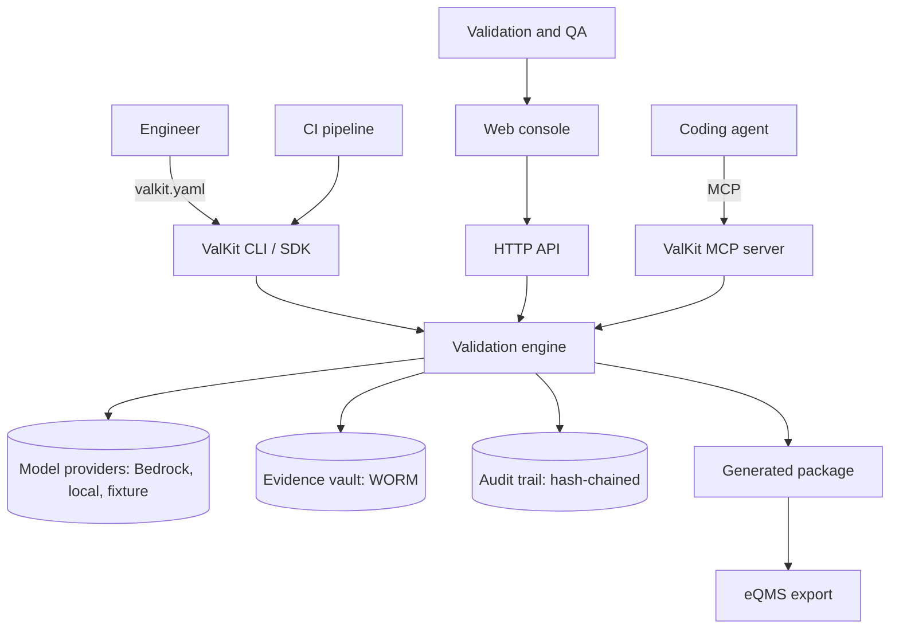
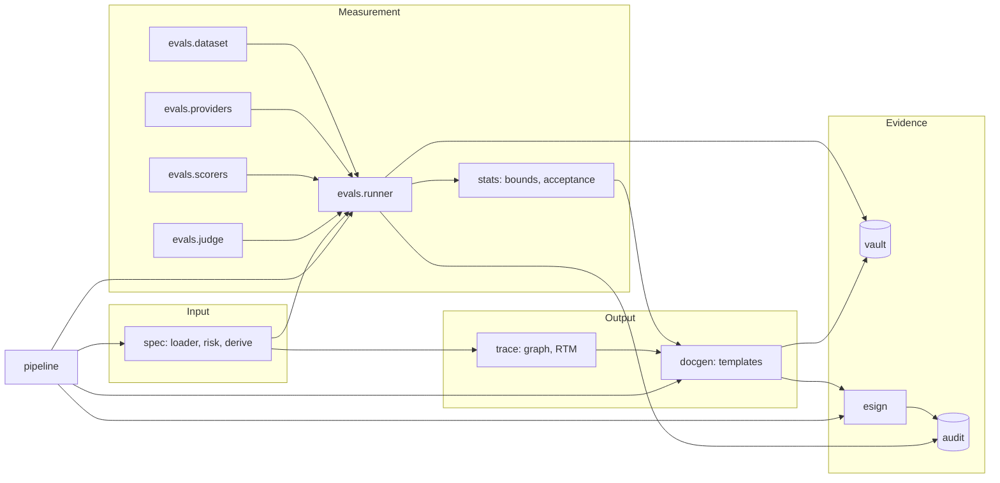
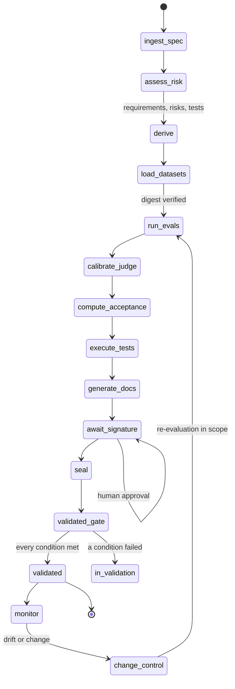
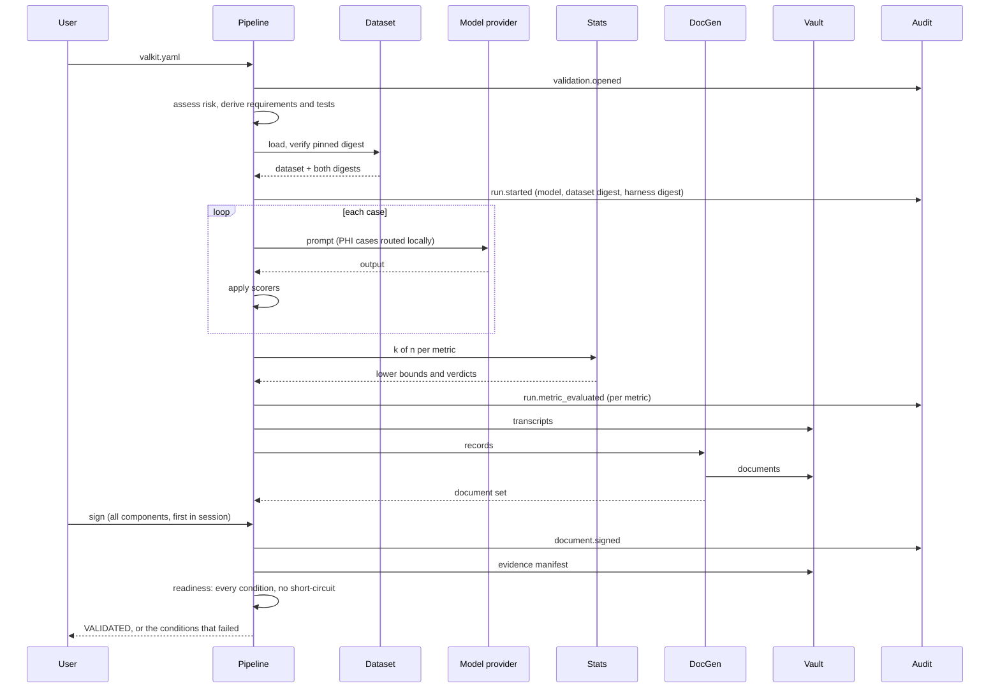
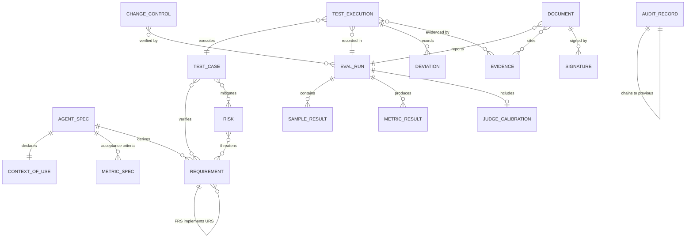
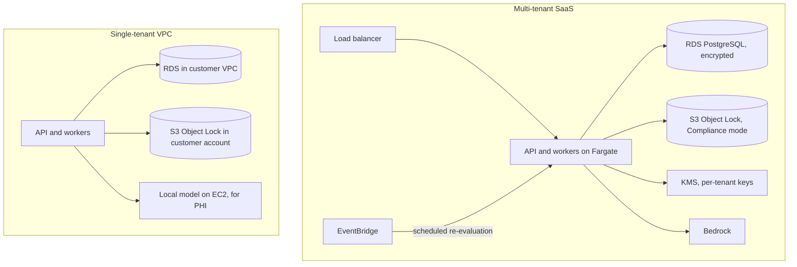
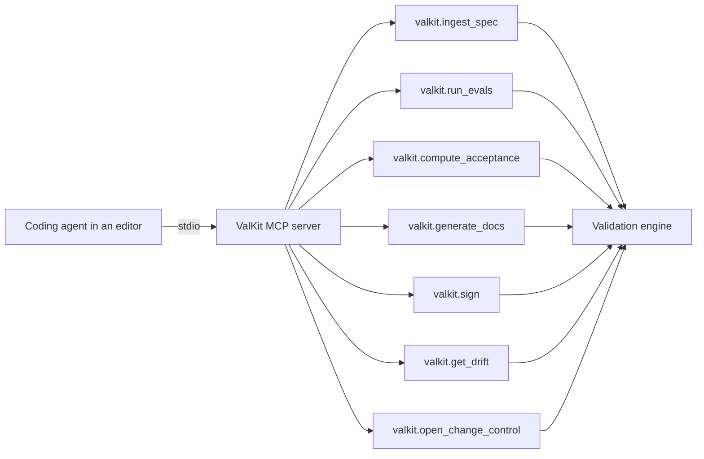
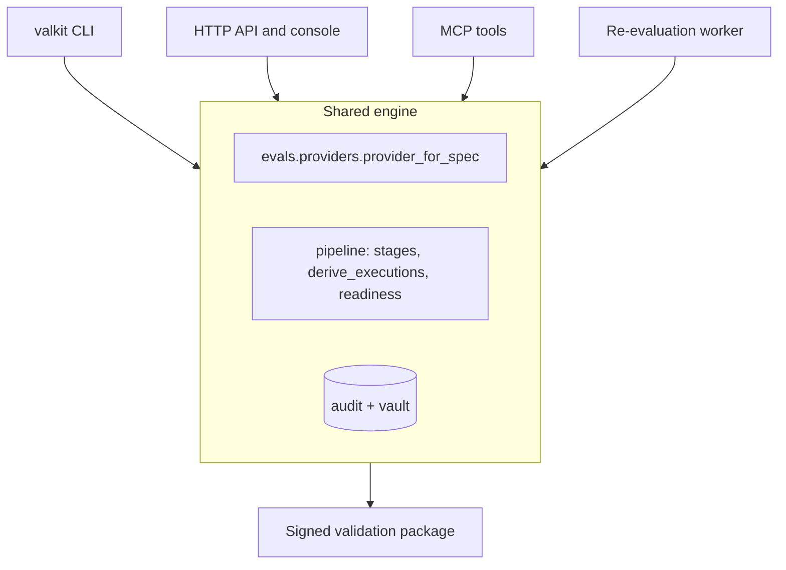
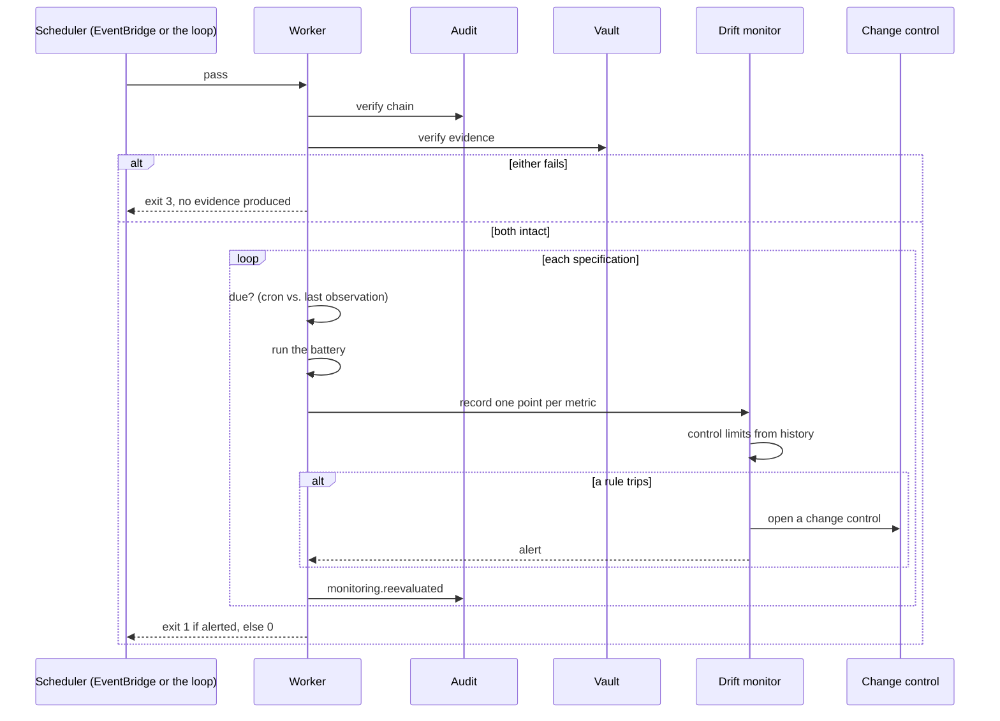

# Architecture

## The shape of the problem

A validation package is a chain of reasoning, not a pile of documents. The
user states what they need; the system states how it provides it; the risk
assessment states what could go wrong; the tests state how each of those is
verified; the evidence states what happened when they ran; and the signatures
state who takes responsibility. A package where that chain is unbroken can be
audited. One where it is not cannot, however good the individual documents look.

ValKit's structure follows that chain, and its layering follows a second
constraint: everything that produces a number must be separable from everything
that presents one, so that a reviewer auditing "how did you decide this passed?"
has exactly one function to read.

## System context

## Components

`valkit.stats` depends on nothing but the standard library. `valkit.spec`,
`valkit.evals`, `valkit.audit`, `valkit.vault` and `valkit.esign` depend on the
domain model and on `stats` where they need it, and not on each other's
internals. `valkit.pipeline` is the only module that knows the order of
operations.

## The validation lifecycle

The interrupt at `await_signature` is the consequential part of the design. A
pipeline that ran to completion without stopping could not implement a human
approval step, and a human approval step in the middle of an automated process
is a regulatory requirement rather than a UX preference. `run_all()` therefore
stops short of signing, deliberately: a pipeline that signed on the author's
behalf would defeat the purpose of requiring a signature.

## One validation run

## Data model

Every edge in the traceability graph is derived from a field one of these
records already carries. Nothing invents a relationship, so the graph is a view
of the package rather than a second source of truth free to drift from it.

## Deployment

Two deployment shapes, because the customers differ. A vendor validating its own
AI features is well served by multi-tenant SaaS. A sponsor whose qualification
data contains protected health information generally is not, and a
single-tenant VPC deployment with a local model for PHI-bearing cases is the
configuration that makes the data-processing position tractable.

The evidence bucket is never public, and the eval workers need egress to the
model provider while the bucket does not. See `infra/` for the detail, including
the constraint that catches people out: **S3 Object Lock cannot be enabled on an
existing bucket**, so it belongs in the plan from the beginning.

## MCP topology

The point of the MCP surface is that an engineer's own coding agent can drive a
validation from inside their editor, so that producing evidence is part of
building the agent rather than a separate project afterwards. Credentials passed
to `valkit.sign` are never echoed in a tool result, since a tool result is model
context and may be persisted in a transcript.

The handlers are plain functions of a context object rather than methods on a
server, so the surface can be tested without a transport and the registry does
not depend on the MCP SDK. Arguments are checked against a JSON Schema subset
before a handler runs, and a ValKit error becomes a structured result rather
than a transport failure — a coding agent can act on `"the target must be less
than 1"` and cannot act on a broken connection.

## The four entry points, and what they share

Four ways in, one engine. That matters more than it looks: a qualification
report generated through a tool call and one generated through the CLI have to
be the same regulatory record, so the derivations that produce them —
`provider_for_spec`, `derive_executions`, `readiness` — live in one place and
every entry point calls them. If they could diverge, the evidence would depend
on the route taken to produce it, which is exactly the property a validation
package cannot have.

The entry points differ only in what they are allowed to do:

| | Runs a battery | Generates documents | Signs | Grants validated status |
| --- | --- | --- | --- | --- |
| CLI | yes | yes | yes, interactively | via the gate |
| HTTP API | yes | yes | yes, one document at a time | via the gate |
| MCP | yes | yes | yes, credential in the call | via the gate |
| Worker | yes | no | **never** | **never** |

The worker's row is the deliberate one. It produces evidence and opens change
controls; it cannot sign and cannot restore validated status. A worker that
could sign could grant validated status to an agent no human had looked at,
which is the opposite of what the signature is for.

## Monitoring and re-evaluation

Integrity is checked before anything is produced, not alongside the results.
Appending new evidence to a chain that does not verify would extend a record
nobody can rely on, and the exit code is what the deployment's alarms watch.

## Decisions worth knowing

**The core depends on PyYAML and Jinja2, and nothing else.** Every third-party
package in a GxP tool is a supplier that has to be assessed. The statistics are
implemented from published algorithms in pure Python so the numerical core can
be qualified by inspection. Optional extras are imported lazily and their
absence raises a clear ValKit error rather than an ImportError.

**Time is injected.** Everything takes a `Clock`. A validation artefact that
cannot be regenerated byte-for-byte cannot be compared against the signed
version, so reproducibility is a structural property rather than a discipline.

**Content addressing rather than checksums.** Evidence lives at a path derived
from the SHA-256 of its bytes, so an identifier that resolves is itself proof of
integrity, writes are idempotent, and overwriting is impossible by construction
rather than merely forbidden.

**Guard rails are named as guard rails.** The SQLite triggers on the audit table
and the read-only file permissions in the vault stop accidents and can be
demonstrated to an inspector, but anyone who can drop a trigger can bypass one.
The hash chain and the content addressing are the actual controls, and the
docstrings say which is which rather than letting a reader infer more assurance
than exists.

**Strictness at the boundaries.** Unknown keys in a specification are rejected;
an undefined template variable raises; a document whose required inputs are
absent is not generated. In ordinary software these would be unfriendly. In a
system whose output gets signed, a silent default is a defect nobody sees.
